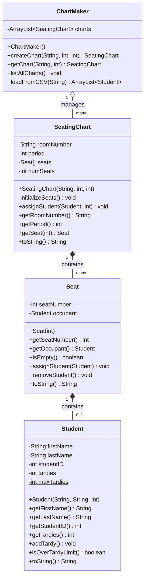

# Seating Chart System

A multi-class project for managing classroom seating charts, demonstrating advanced object-oriented design with four interconnected classes.

## System Architecture



## Class 1: Student

Represents a student with tracking for tardies.

```java
public class Student {
    private String firstName;
    private String lastName;
    private int studentID;
    private int tardies;
    private static int maxTardies = 10;

    public Student(String firstName, String lastName, int studentID) {
        this.firstName = firstName;
        this.lastName = lastName;
        this.studentID = studentID;
        this.tardies = 0;
    }

    public String getFirstName() { return firstName; }
    public String getLastName() { return lastName; }
    public int getStudentID() { return studentID; }
    public int getTardies() { return tardies; }

    public void addTardy() { tardies++; }
    public boolean isOverTardyLimit() { return tardies > maxTardies; }

    public String toString() {
        return "[" + lastName + ", " + firstName.substring(0, 1) + ".]";
    }
}
```

## Class 2: Seat

Represents a single seat that may or may not have a student.

```java
public class Seat {
    private int seatNumber;
    private Student occupant;

    public Seat(int seatNumber) {
        this.seatNumber = seatNumber;
        this.occupant = null;
    }

    public int getSeatNumber() { return seatNumber; }

    public Student getOccupant() { return occupant; }

    public boolean isEmpty() { return occupant == null; }

    public void assignStudent(Student student) {
        if (isEmpty()) {
            occupant = student;
        } else {
            System.out.println("Seat already occupied!");
        }
    }

    public void removeStudent() { occupant = null; }

    public String toString() {
        if (isEmpty()) {
            return "[---EMPTY---]";
        } else {
            return occupant.toString();
        }
    }
}
```

## Class 3: SeatingChart

Manages an array of Seats for a specific room and period.

```java
public class SeatingChart {
    private String roomNumber;
    private int period;
    private Seat[] seats;
    private int numSeats;

    public SeatingChart(String roomNumber, int period, int numSeats) {
        this.roomNumber = roomNumber;
        this.period = period;
        this.numSeats = numSeats;
        seats = new Seat[numSeats];
        initializeSeats();
    }

    private void initializeSeats() {
        for (int i = 0; i < numSeats; i++) {
            seats[i] = new Seat(i + 1);
        }
    }

    public void assignStudent(Student student, int seatNumber) {
        if (seatNumber >= 1 && seatNumber <= numSeats) {
            seats[seatNumber - 1].assignStudent(student);
        } else {
            System.out.println("Invalid seat number!");
        }
    }

    public String getRoomNumber() { return roomNumber; }

    public int getPeriod() { return period; }

    public Seat getSeat(int seatNumber) {
        return seats[seatNumber];
    }

    public String toString() {
        String result = "Seating Chart - Room " + roomNumber +
                        ", Period " + period + "\n";
        for (int i = 0; i < numSeats; i++) {
            result += "Seat " + (i + 1) + ": " + seats[i].toString() + "\n";
        }
        return result;
    }
}
```

## Class 4: ChartMaker

Manages multiple seating charts and provides CSV import functionality.

```java
import java.util.ArrayList;
import java.io.File;
import java.io.IOException;
import java.util.Scanner;

public class ChartMaker {
    private ArrayList<SeatingChart> charts;

    public ChartMaker() {
        charts = new ArrayList<SeatingChart>();
    }

    public SeatingChart createChart(String roomNumber, int period, int numSeats) {
        SeatingChart newChart = new SeatingChart(roomNumber, period, numSeats);
        charts.add(newChart);
        return newChart;
    }

    public SeatingChart getChart(String roomNumber, int period) {
        for (SeatingChart chart : charts) {
            if (chart.getRoomNumber().equals(roomNumber) &&
                chart.getPeriod() == period) {
                return chart;
            }
        }
        return null;
    }

    public void listAllCharts() {
        System.out.println("All Seating Charts:");
        System.out.println("==================");
        for (SeatingChart chart : charts) {
            System.out.println(chart.toString());
            System.out.println();
        }
    }

    public ArrayList<Student> loadFromCSV(String filename) throws IOException {
        File file = new File(filename);
        Scanner scanner = new Scanner(file);
        ArrayList<Student> students = new ArrayList<Student>();

        // Skip header line
        if (scanner.hasNext()) {
            scanner.nextLine();
        }

        // Read student data and create Student objects
        while (scanner.hasNext()) {
            String line = scanner.nextLine();
            String[] fields = line.split(",");

            // Parse student data (firstName, lastName, id)
            String firstName = fields[0];
            String lastName = fields[1];
            int studentID = Integer.parseInt(fields[2]);

            // Create Student object and add to list
            Student student = new Student(firstName, lastName, studentID);
            students.add(student);
        }

        scanner.close();
        return students;
    }
}
```

## Key Concepts Demonstrated

### 1. **Object Composition (Multiple Levels)**
- ChartMaker contains ArrayList of SeatingChart
- SeatingChart contains array of Seat
- Seat contains Student (or null)

### 2. **Arrays of Objects**
- `Seat[] seats` - array storing Seat objects
- Initialization pattern in `initializeSeats()`

### 3. **ArrayList Operations**
- `ArrayList<SeatingChart>` for dynamic collection
- `ArrayList<Student>` for CSV data
- Enhanced for loop for traversal

### 4. **Null Handling**
- `occupant` can be null (empty seat)
- `isEmpty()` checks for null
- Defensive programming in `assignStudent()`

### 5. **File I/O with CSV**
- Scanner for file reading
- String splitting with `split(",")`
- Integer parsing with `Integer.parseInt()`

### 6. **Static Variables**
- `maxTardies` shared across all Student objects
- Demonstrates class-level vs instance-level data

### 7. **Private Helper Methods**
- `initializeSeats()` is private
- Called from constructor to set up the array

### 8. **String Manipulation**
- `substring()` for first initial
- String concatenation in `toString()`

## Example Usage

```java
// Create a ChartMaker to manage all charts
ChartMaker manager = new ChartMaker();

// Create a seating chart for Room 237, Period 2, with 24 seats
SeatingChart period2 = manager.createChart("237", 2, 24);

// Load students from CSV file
try {
    ArrayList<Student> students = manager.loadFromCSV("students.csv");

    // Assign students to seats
    for (int i = 0; i < students.size(); i++) {
        period2.assignStudent(students.get(i), i + 1);
    }
} catch (IOException e) {
    System.out.println("Error reading file: " + e.getMessage());
}

// Display the seating chart
System.out.println(period2.toString());

// Check a specific seat
Seat seat5 = period2.getSeat(5);
if (!seat5.isEmpty()) {
    Student student = seat5.getOccupant();
    System.out.println("Seat 5: " + student.getFirstName() + " " +
                       student.getLastName());
}

// Add a tardy
seat5.getOccupant().addTardy();

// List all charts
manager.listAllCharts();
```

## CSV File Format (students.csv)

```csv
firstName,lastName,studentID
Alice,Anderson,12345
Bob,Brown,12346
Charlie,Chen,12347
```

## Design Patterns Used

1. **Composition Over Inheritance** - Objects contain other objects
2. **Single Responsibility** - Each class has one clear purpose
3. **Encapsulation** - Private fields, public methods
4. **Factory Pattern** - ChartMaker creates SeatingChart objects
5. **Collection Management** - ChartMaker manages multiple charts

## Possible Enhancements

- Add 2D array for row/column layout
- Random seating assignment
- Seat swapping functionality
- Export to CSV
- Search for student by name
- Alphabetical seating
- Separate students by criteria
