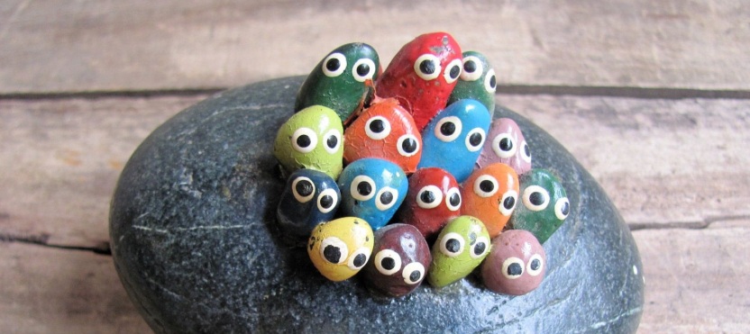

---

title: "A Pet Rock Simulator"
description: "This code demonstrates how to get input from the console and use it to control the behavior of the simulation."
date: 2025-08-25
tags: ['week35','java.util.Scanner']

---



```java
import java.util.Scanner;

/**
 * Pet Rock Simulator - Demonstrates Scanner methods for keyboard input
 * This program showcases all the key Scanner methods in an engaging context
 */
public class PetRockSimulator {
    public static void main(String[] args) {
        // Create Scanner object for keyboard input
        Scanner input = new Scanner(System.in);
        
        // Get pet rock name using nextLine()
        System.out.println("🪨 Welcome to the Pet Rock Simulator! 🪨");
        System.out.print("What would you like to name your pet rock? ");
        String rockName = input.nextLine();
        
        // Initialize rock stats
        int shine = 50;
        int contentment = 30;
        double musical = 0.0;
        int rest = 100;
        
        // Display welcome message with rock name
        System.out.println("\n🎉 Meet " + rockName + "! Your new pet rock is ready for care!");
        System.out.println(rockName + " sits silently, waiting for your attention...\n");
        
        // Main care routine loop 
        boolean keepCaring = true;
        while (keepCaring) {
            // Show current rock stats
            System.out.println("=== " + rockName + "'s Current Status ===");
            System.out.println("✨ Shine Level: " + shine);
            System.out.println("😊 Contentment: " + contentment);
            System.out.println("🎵 Musical Appreciation: " + musical);
            System.out.println("😴 Rest Quality: " + rest);
            System.out.println();
            
            // Display care menu
            System.out.println("What would you like to do with " + rockName + "?");
            System.out.println("1. Polish rock");
            System.out.println("2. Move to new location");
            System.out.println("3. Sing to rock");
            System.out.println("4. Bedtime routine");
            System.out.println("5. Exit");
            System.out.print("Enter your choice (1-5): ");
            
            // Get choice using nextInt()
            int choice = input.nextInt();
            System.out.println();
            
            // Handle different choices
            if (choice == 1) {
                // Polish rock - uses nextInt()
                System.out.print("How many minutes will you spend polishing " + rockName + "? ");
                int minutes = input.nextInt();
                
                // Calculate shine increase
                shine += minutes * 2;
                
                // Display result
                System.out.println("✨ " + rockName + " gleams with joy after " + minutes + " minutes of polishing!");
                System.out.println("Shine increased by " + (minutes * 2) + " points!\n");
                
            } else if (choice == 2) {
                // Move to new location - uses nextBoolean()
                System.out.print("Should " + rockName + " move to a sunny spot? (type: true or false): ");
                boolean moveToSun = input.nextBoolean();
                
                if (moveToSun) {
                    contentment += 25;
                    System.out.println("☀️ " + rockName + " basks happily in the warm sunlight!");
                    System.out.println("Contentment increased by 25 points!\n");
                } else {
                    contentment -= 10;
                    System.out.println("🌧️ " + rockName + " seems a bit gloomy in the shadows...");
                    System.out.println("Contentment decreased by 10 points.\n");
                }
                
            } else if (choice == 3) {
                // Sing to rock - uses nextDouble()
                System.out.print("How long will you sing to " + rockName + " (in minutes)? ");
                double singTime = input.nextDouble();
                
                // Calculate musical appreciation increase
                musical += singTime * 1.5;
                
                // Display result
                System.out.println("🎵 " + rockName + " vibrates with musical appreciation!");
                System.out.println("You sang for " + singTime + " minutes. Musical appreciation increased by " + (singTime * 1.5) + " points!\n");
                
            } else if (choice == 4) {
                // Bedtime routine - uses nextBoolean()
                System.out.print("Should you tuck " + rockName + " into a cozy bed? (type: true or false): ");
                boolean tuckIn = input.nextBoolean();
                
                if (tuckIn) {
                    rest = 100;
                    System.out.println("😴 " + rockName + " sleeps peacefully in its soft bed!");
                    System.out.println("Rest quality restored to maximum!\n");
                } else {
                    rest -= 20;
                    System.out.println("😵 " + rockName + " tosses and turns on the hard surface...");
                    System.out.println("Rest quality decreased by 20 points.\n");
                }
                
            } else if (choice == 5) {
                // Exit - set keepCaring to false to end loop
                keepCaring = false;
                
            } else {
                System.out.println("❌ Invalid choice! " + rockName + " stares at you blankly.\n");
            }
        }
        
        // Display final rock stats
        System.out.println("\n🏁 === Final Care Report for " + rockName + " ===");
        System.out.println("✨ Final Shine Level: " + shine);
        System.out.println("😊 Final Contentment: " + contentment);
        System.out.println("🎵 Final Musical Appreciation: " + musical);
        System.out.println("😴 Final Rest Quality: " + rest);
        System.out.println();
        
        if (shine > 80 && contentment > 50) {
            System.out.println("🏆 Congratulations! " + rockName + " is a very happy and well-cared-for rock!");
        } else if (shine < 30 && contentment < 20) {
            System.out.println("😢 " + rockName + " needs more attention. Rocks have feelings too!");
        } else {
            System.out.println("👍 " + rockName + " appreciates your care efforts!");
        }
        
        System.out.println("Thanks for taking care of " + rockName + "! 🪨");
        
        // Close Scanner - proper cleanup
        input.close();
    }
}
```