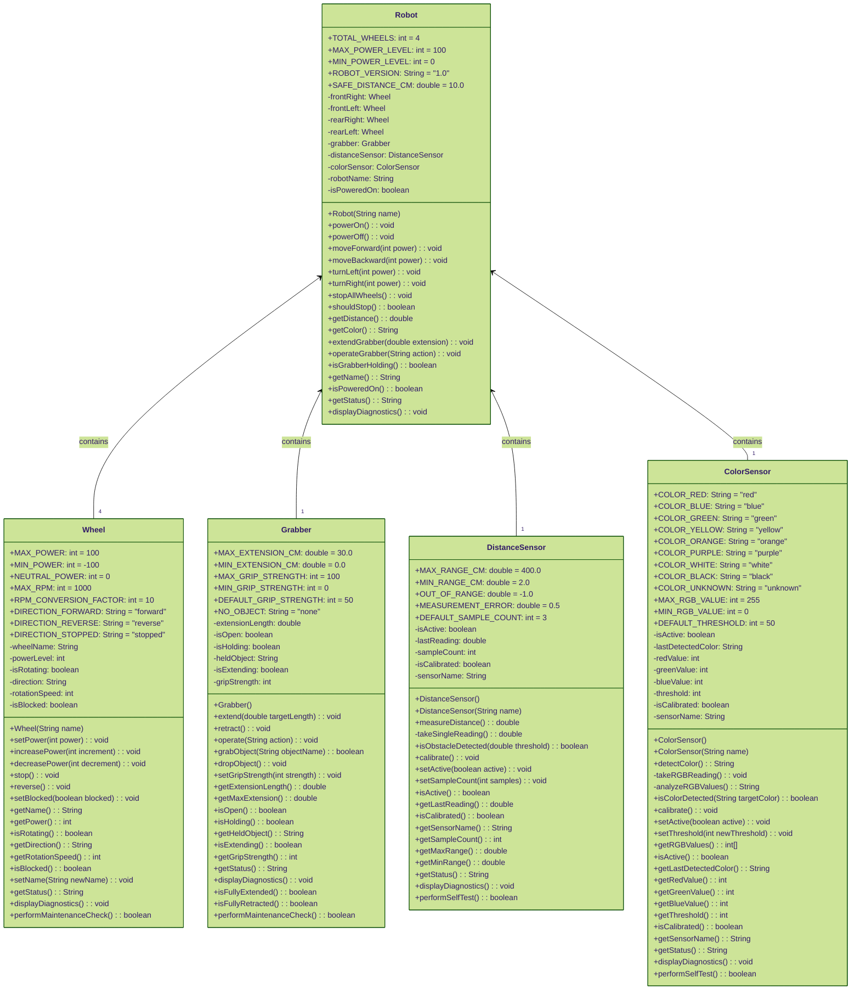

# Robot System Class Diagram

This diagram shows the complete structure of our robot system, including all classes, their attributes, methods, and relationships.

## Complete Robot System Overview

## Key Relationships Explained

### Composition Relationships (<--)
- **Robot contains 4 Wheels**: Each robot has exactly four wheel objects (frontLeft, frontRight, rearLeft, rearRight)
- **Robot contains 1 Grabber**: Each robot has one grabber mechanism for picking up objects
- **Robot contains 1 DistanceSensor**: Each robot has one distance sensor for obstacle detection
- **Robot contains 1 ColorSensor**: Each robot has one color sensor for object identification

### Class Structure Notes

**UML Visibility Notation:**
- **+ (plus sign) = Public**: Accessible from other classes
- **- (minus sign) = Private**: Only accessible within the same class

**Constants (+ prefix - public static final):**
- All classes use `public static final` constants for configuration values
- Examples: `+MAX_POWER: int = 100`, `+SAFE_DISTANCE_CM: double = 10.0`
- Constants improve code maintainability and eliminate "magic numbers"

**Instance Variables (- prefix - private):**
- All instance variables are `private` for proper encapsulation
- Examples: `-wheelName: String`, `-isPoweredOn: boolean`
- Access is controlled through public getter and setter methods

**Public Methods (+ prefix):**
- Public methods provide controlled access to class functionality
- Examples: `+setPower(int power): void`, `+detectColor(): String`
- Form the public interface that other classes can use

**Private Methods (- prefix):**
- Private helper methods are internal implementation details
- Examples: `-takeSingleReading(): double`, `-analyzeRGBValues(): String`
- Cannot be called directly from other classes

**Constructor Overloading:**
- Both sensor classes show constructor overloading with default and named versions

This diagram illustrates the **composition** design pattern where the Robot class is built from multiple component objects, demonstrating how complex systems can be constructed from simpler, reusable parts.