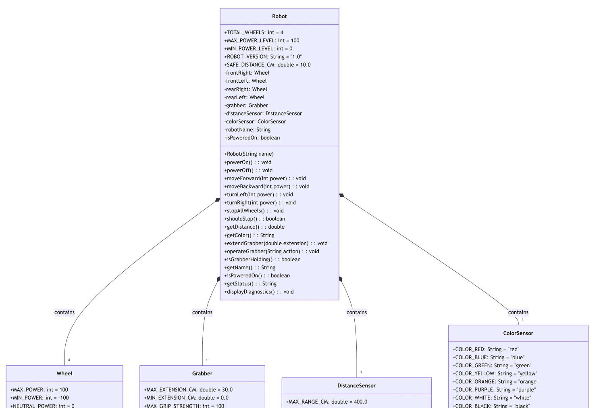

# Robot System Visual Class Diagram

This visual diagram shows the complete structure of our robot system, including all classes, their attributes, methods, and the relationships between them.

## Understanding the Diagram

### Classes Shown:
- **Robot**: The main controller class that manages all robot components
- **Wheel**: Individual wheel control (4 instances per robot)
- **Grabber**: Telescoping grabber mechanism for object manipulation
- **DistanceSensor**: Ultrasonic sensor for obstacle detection
- **ColorSensor**: RGB sensor for object color identification

### Key Features Illustrated:

**Constants (+ prefix)**:
- All classes use `public static final` constants
- Examples: `MAX_POWER = 100`, `SAFE_DISTANCE_CM = 10.0`
- Eliminates "magic numbers" and improves maintainability

**Instance Variables (- prefix)**:
- All instance variables are `private` for encapsulation
- Examples: `-wheelName: String`, `-isPoweredOn: boolean`
- Access controlled through public methods

**Public Methods (+ prefix)**:
- Interface for interacting with each class
- Examples: `+setPower(int power)`, `+detectColor(): String`
- Provide controlled access to class functionality

**Composition Relationships**:
- **Robot *-- "4" Wheel**: Robot contains exactly 4 wheels
- **Robot *-- "1" Grabber**: Robot contains 1 grabber
- **Robot *-- "1" DistanceSensor**: Robot contains 1 distance sensor  
- **Robot *-- "1" ColorSensor**: Robot contains 1 color sensor

### Object-Oriented Concepts Demonstrated:

1. **Encapsulation**: Private variables with public method access
2. **Composition**: Robot is built from component objects
3. **Constants**: Using `final` for unchanging values
4. **Constructor Overloading**: Multiple ways to create sensor objects
5. **Method Signatures**: Clear parameter types and return values

This diagram illustrates how complex systems can be constructed from simpler, reusable components - a fundamental principle of object-oriented design.